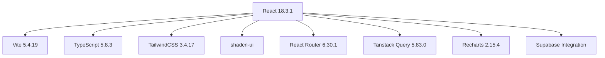

# 📋 سجل التطوير المهني - ترافليون Traveliun
## وثيقة التطوير والتحسين الشاملة

---

## 📌 معلومات المشروع

| الخاصية | القيمة |
|---------|--------|
| **اسم المشروع** | ترافليون Traveliun - موقع السياحة والسفر |
| **الإصدار الحالي** | 0.0.0 |
| **تاريخ الفحص** | 28 ديسمبر 2025 |
| **مستوى النضج** | MVP - نموذج أولي |
| **حالة المشروع** | 🟡 يحتاج تحسينات |

---

## 🛠️ التقنيات المستخدمة



### المكتبات الرئيسية
- **UI Framework**: shadcn-ui + Radix UI
- **Styling**: TailwindCSS + CSS Variables
- **Forms**: React Hook Form + Zod
- **State Management**: Tanstack Query
- **Routing**: React Router DOM
- **Charts**: Recharts
- **Notifications**: Sonner + Toaster
- **Date Handling**: date-fns

---

## 📊 تحليل الهيكل الحالي

### هيكل الملفات
```
src/
├── assets/          # الصور (11 ملف)
├── components/      # المكونات (57 مكون)
│   ├── ui/          # مكونات shadcn (49 مكون)
│   └── *.tsx        # مكونات مخصصة (8 مكونات)
├── hooks/           # الخطافات (2 خطاف)
├── integrations/    # التكاملات
│   └── supabase/    # Supabase client
├── lib/             # المكتبات المساعدة
├── pages/           # الصفحات (4 صفحات)
│   ├── Index.tsx
│   ├── Destinations.tsx
│   ├── DestinationDetails.tsx
│   └── NotFound.tsx
└── App.tsx
```

### الصفحات المتاحة
| الصفحة | المسار | الحالة | ملاحظات |
|--------|--------|--------|---------|
| الرئيسية | `/` | ✅ موجودة | كاملة |
| الوجهات | `/destinations` | ✅ موجودة | كاملة |
| تفاصيل الوجهة | `/destinations/:id` | ✅ موجودة | كاملة |
| شهر العسل | `/honeymoon` | ❌ غير موجودة | رابط معطل |
| العروض | `/offers` | ❌ غير موجودة | رابط معطل |
| من نحن | `/about` | ❌ غير موجودة | رابط معطل |
| تواصل معنا | `/contact` | ❌ غير موجودة | رابط معطل |
| سياسة الخصوصية | `/privacy` | ❌ غير موجودة | رابط معطل |
| الشروط والأحكام | `/terms` | ❌ غير موجودة | رابط معطل |

---

## 🌟 نقاط القوة

### 1. التصميم البصري ⭐⭐⭐⭐⭐
- ✅ نظام ألوان متناسق ومميز (تيل + ذهبي)
- ✅ تدرجات لونية فاخرة
- ✅ رسوم متحركة وتأثيرات حركية
- ✅ تصميم glassmorphism حديث
- ✅ ظلال متدرجة احترافية

### 2. تجربة المستخدم ⭐⭐⭐⭐
- ✅ دعم كامل للغة العربية (RTL)
- ✅ تصميم متجاوب responsive
- ✅ Header ديناميكي يتغير مع التمرير
- ✅ قائمة جوال responsive
- ✅ أزرار CTA واضحة للواتساب

### 3. البنية التقنية ⭐⭐⭐⭐
- ✅ استخدام TypeScript للأمان
- ✅ مكونات قابلة لإعادة الاستخدام
- ✅ CSS Variables للثيمات
- ✅ تكامل مع Supabase جاهز
- ✅ دعم Dark Mode مُعّد

### 4. SEO والأداء ⭐⭐⭐⭐
- ✅ Meta tags شاملة
- ✅ Open Graph tags
- ✅ Twitter Cards
- ✅ خطوط Google محملة مسبقاً

---

## 🐛 سجل الأخطاء والمشاكل

### 🔴 حرجة (Critical)

#### BUG-001: صفحات معطلة (Broken Routes)
```
الوصف: 6 روابط في Header و Footer تؤدي إلى صفحات غير موجودة
التأثير: تجربة مستخدم سيئة - يظهر 404
الموقع: Header.tsx (سطور 23-33)، Footer.tsx
المتأثرون: جميع المستخدمين
الأولوية: عالية جداً
```
**الصفحات المفقودة:**
- `/honeymoon` - شهر العسل
- `/offers` - العروض  
- `/about` - من نحن
- `/contact` - تواصل معنا
- `/privacy` - سياسة الخصوصية
- `/terms` - الشروط والأحكام

---

#### BUG-002: محتوى ناقص في HeroSection
```
الوصف: عناصر فارغة في قسم البطل
الموقع: HeroSection.tsx (سطور 41-53, 72-75)
المشكلة: 
  - أزرار CTA فارغة (سطور 50-52)
  - إحصائيات بدون قيم (سطور 72-75)
التأثير: قسم رئيسي يبدو ناقصاً
```

**الكود المشكل:**
```tsx
// السطور 50-52 - زر فارغ
<a href="https://api.whatsapp.com/send?phone=966569222111">
  {/* لا يوجد محتوى */}
</a>

// السطور 72-75 - إحصائيات فارغة
{stats.map((stat, index) => <div key={index} className="text-center">
    {/* لا يوجد محتوى */}
</div>)}
```

---

#### BUG-003: صفحة 404 بالإنجليزية
```
الوصف: صفحة الخطأ 404 باللغة الإنجليزية فقط
الموقع: NotFound.tsx
التأثير: تناقض مع باقي الموقع العربي
الأولوية: متوسطة
```

---

### 🟡 متوسطة (Medium)

#### BUG-004: أيقونات التواصل الاجتماعي غير فعالة
```
الوصف: روابط السوشيال ميديا تشير إلى "#" فقط
الموقع: Footer.tsx (سطر 24-31)
الحل: إضافة الروابط الفعلية
```

---

#### BUG-005: فلتر الوجهات غير فعال
```
الوصف: أزرار التصفية في صفحة الوجهات ديكور فقط
الموقع: Destinations.tsx (سطور 36-49)
التأثير: توقع المستخدم لعمل الفلتر
```

---

#### BUG-006: تقييمات ثابتة Hardcoded
```
الوصف: التقييم "4.8" ثابت لجميع الوجهات
الموقع: Destinations.tsx، DestinationDetails.tsx
الحل: جعل التقييم ديناميكي من البيانات
```

---

### 🟢 منخفضة (Low)

#### BUG-007: تكرار الـ Toaster
```
الوصف: يوجد Toaster و Sonner معاً في App.tsx
الموقع: App.tsx (سطور 1-2, 16-17)
الحل: اختيار واحد فقط
```

---

#### BUG-008: صور بدون Lazy Loading
```
الوصف: جميع الصور تُحمل دفعة واحدة
التأثير: بطء التحميل الأولي
الحل: إضافة loading="lazy"
```

---

## 📝 خطة التحسين المقترحة

### المرحلة 1: إصلاحات حرجة (أسبوع 1)

#### 1.1 إنشاء الصفحات المفقودة
| الأولوية | الصفحة | الوقت المتوقع |
|----------|--------|--------------|
| 1 | Contact.tsx | 4 ساعات |
| 2 | About.tsx | 4 ساعات |
| 3 | Honeymoon.tsx | 6 ساعات |
| 4 | Offers.tsx | 6 ساعات |
| 5 | Privacy.tsx | 2 ساعات |
| 6 | Terms.tsx | 2 ساعات |

#### 1.2 إصلاح HeroSection
```tsx
// المحتوى المفقود للإحصائيات
<div className="text-center">
  <div className="text-3xl md:text-4xl font-bold mb-1">{stat.number}</div>
  <div className="text-sm opacity-80">{stat.label}</div>
</div>

// أزرار CTA المفقودة
<Button className="bg-secondary hover:bg-secondary/90 text-secondary-foreground rounded-full px-8 py-6 text-lg">
  احجز رحلتك الآن
</Button>
```

#### 1.3 تعريب صفحة 404
```tsx
<h1 className="mb-4 text-4xl font-bold">404</h1>
<p className="mb-4 text-xl text-gray-600">عذراً! الصفحة غير موجودة</p>
<a href="/" className="text-primary underline hover:text-primary/80">
  العودة للرئيسية
</a>
```

---

### المرحلة 2: تحسينات متوسطة (أسبوع 2)

#### 2.1 تفعيل فلتر الوجهات
```tsx
// إضافة state للفلتر
const [activeFilter, setActiveFilter] = useState("الكل");

// فلترة الوجهات
const filteredDestinations = useMemo(() => {
  if (activeFilter === "الكل") return destinations;
  return destinations.filter(d => d.region === activeFilter);
}, [activeFilter]);
```

#### 2.2 إضافة روابط السوشيال ميديا
```tsx
const socialLinks = [
  { icon: Facebook, href: "https://facebook.com/traveliun" },
  { icon: Instagram, href: "https://instagram.com/traveliun" },
  { icon: Twitter, href: "https://twitter.com/traveliun" },
];
```

#### 2.3 تحسين التقييمات
```tsx
// إضافة rating للبيانات
const destinations = [
  { id: "malaysia", rating: 4.9, reviewCount: 520, ... },
  { id: "thailand", rating: 4.7, reviewCount: 380, ... },
];
```

---

### المرحلة 3: تحسينات الأداء (أسبوع 3)

#### 3.1 Lazy Loading للصور
```tsx

```

#### 3.2 Code Splitting للصفحات
```tsx
const Honeymoon = lazy(() => import('./pages/Honeymoon'));
const Offers = lazy(() => import('./pages/Offers'));
const About = lazy(() => import('./pages/About'));
const Contact = lazy(() => import('./pages/Contact'));
```

#### 3.3 تحسين الخطوط
```html
<link rel="preload" as="font" href="..." crossorigin>
```

---

### المرحلة 4: ميزات جديدة (أسبوع 4+)

#### 4.1 نظام الحجز
- [ ] نموذج حجز تفاعلي
- [ ] تكامل مع نظام الدفع
- [ ] إشعارات البريد الإلكتروني

#### 4.2 نظام المستخدمين
- [ ] تسجيل الدخول
- [ ] حفظ الوجهات المفضلة
- [ ] سجل الحجوزات

#### 4.3 مدونة السفر
- [ ] مقالات سياحية
- [ ] نصائح السفر
- [ ] تجارب العملاء

#### 4.4 دعم متعدد اللغات
- [ ] الإنجليزية
- [ ] الفرنسية

---

## 📈 مؤشرات الأداء المقترحة (KPIs)

| المؤشر | الهدف | الحالي |
|--------|-------|--------|
| وقت التحميل الأولي | < 2s | غير مقاس |
| Lighthouse Performance | > 90 | غير مقاس |
| Lighthouse SEO | > 95 | غير مقاس |
| Lighthouse Accessibility | > 90 | غير مقاس |
| معدل الارتداد | < 40% | غير مقاس |

---

## 🔧 أوامر التطوير

```bash
# تثبيت التبعيات
npm install

# تشغيل بيئة التطوير
npm run dev

# بناء للإنتاج
npm run build

# معاينة البناء
npm run preview

# فحص الكود
npm run lint
```

---

## 📚 مراجع ومصادر

- [Vite Documentation](https://vitejs.dev/)
- [React Documentation](https://react.dev/)
- [TailwindCSS](https://tailwindcss.com/)
- [shadcn-ui](https://ui.shadcn.com/)
- [Supabase](https://supabase.com/)

---

## 📝 سجل التغييرات (Changelog)

### [غير مُصدر] - 2025-12-28
#### تم الفحص
- تحليل شامل لجميع ملفات المشروع
- توثيق 8 أخطاء ومشاكل
- إنشاء خطة تحسين من 4 مراحل

### [0.0.0] - الإصدار الأولي
- إنشاء المشروع الأساسي
- 4 صفحات رئيسية
- 8 مكونات مخصصة
- نظام تصميم متكامل

---

## 👥 فريق العمل

| الدور | المسؤولية |
|-------|-----------|
| Frontend Developer | تطوير الواجهة |
| UI/UX Designer | التصميم والتجربة |
| Backend Developer | تكامل Supabase |
| QA Engineer | الاختبار والجودة |

---

## 📞 للتواصل

- **الموقع**: [traveliun.com.sa](https://traveliun.com.sa)
- **البريد**: booking@traveliun.com
- **الهاتف**: +966 569 222 111

---

> 📌 **ملاحظة**: هذه الوثيقة يجب تحديثها مع كل تغيير جوهري في المشروع

---

*آخر تحديث: 28 ديسمبر 2025*
